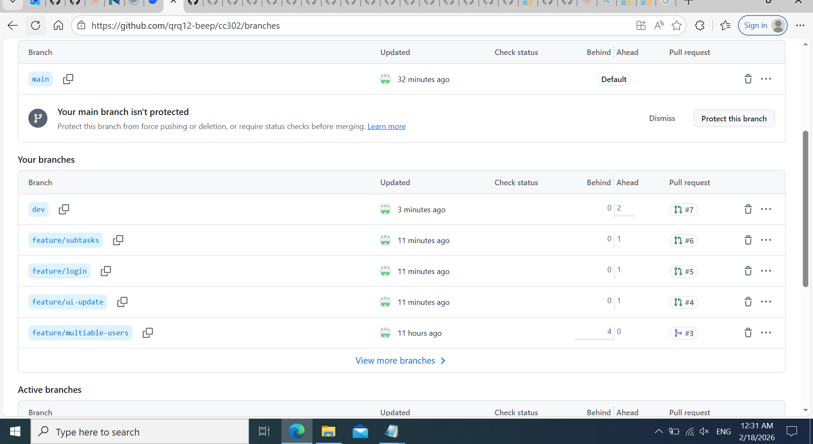
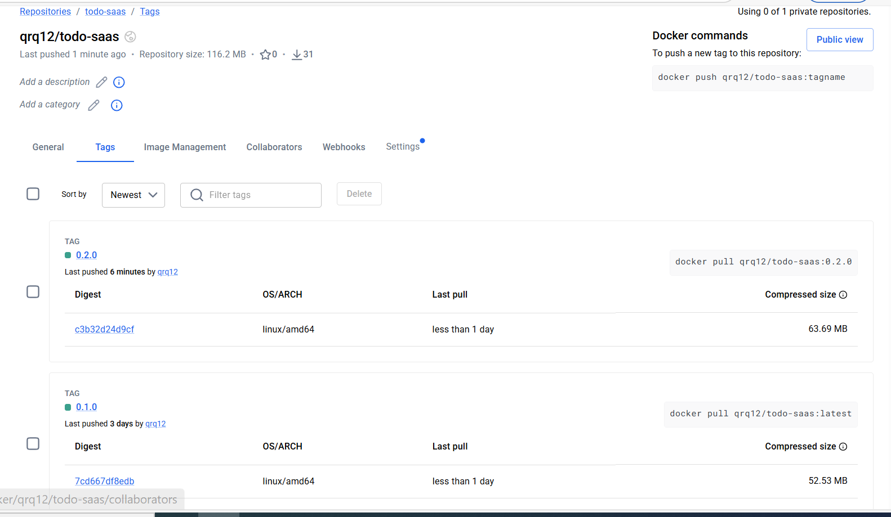

# 📋 PRD Submission Proof - To-Do App v0.1.0

**Student:** qrq12-beep
**Repository:** https://github.com/qrq12-beep/cc302
**Submission Date:** February 17, 2026

---

## ✅ Project Overview

- **Application:** Flask-based To-Do App
- **Main Branch:** main
- **Release Tag:** v0.1.0
- **GitHub Release:** https://github.com/qrq12-beep/cc302/releases/tag/v0.1.0
- **Docker Image:** docker.io/qrq12/todo-saas:0.2.0

---

## ✅ Key Features (v0.1.0)

1. User authentication: registration, login, logout and session handling (see `app.py` auth endpoints).
2. Task management: create/read/update/delete tasks with title, description, category, priority, due date, tags, and completion toggle.
3. Subtasks & stats: per-task subtasks (create/update/delete/reorder) and basic stats endpoint (total/completed/pending/priority counts).
4. statistics and clean UI
---

## Evidence and Commands

- **List branches:**

```bash
git branch -a
```

- **Build Docker image:**

```bash
docker build -t qrq12/todo-saas:0.2.0 -f Dockerfile .
```

- **Run container locally:**

```bash
docker run -p 5000:5000 qrq12/todo-saas:0.2.0
# App should be available at http://localhost:5000
```

- **Git tag & release (already created):**

```bash
git tag -a v0.1.0 -m "v0.1.0: initial release"
git push origin v0.1.0
# Release: https://github.com/qrq12-beep/cc302/releases/tag/v0.1.0
```

---

## Screenshots


- `screenshots/branch_list.png` — branch list output or screenshot
  
    
- `screenshots/dockerhub_tags.png` — Docker Hub tags view
  
   
---

## Short Reflection

> Using a simple `main` → `dev` → feature branch workflow helped isolate work, made reviews easier, and let CI validate changes before release. Tagging releases and publishing Docker images made deployments repeatable.

---

## Final Checklist

- [x] Repository created on GitHub
- [x] Dockerfile present (`/Dockerfile`)
- [x] Docker image built and pushed (`qrq12/todo-saas:0.2.0`)
- [x] Git tag `v0.1.0` created and release published
- [x] Core features implemented: auth, tasks, subtasks & stats

---

If you want this adjusted for a different student name, repo URL, or to include screenshots/assets, tell me and I'll update the file.

---

## Required Evidence 

- **3 Feature PR links (feature → dev)**

	1. https://github.com/qrq12-beep/cc302/pull/4
	2. https://github.com/qrq12-beep/cc302/pull/5
	3. https://github.com/qrq12-beep/cc302/pull/6

- **Dev → Main PR link (release)**

	4. https://github.com/qrq12-beep/cc302/pull/7

- **DockerHub screenshot (tags visible)**

	

- **GitHub Release link**

	https://github.com/qrq12-beep/cc302/releases/tag/v0.1.0

- **Short paragraph: What I learned about branching + merging**

	Working with feature branches and an integration `dev` branch taught me the value of isolating changes, running CI on each PR, and keeping merges small and frequent. This workflow reduced merge conflicts, made code review focused and manageable, and allowed the team to verify each feature before it reached `main`.

---

Place or replace the placeholder images in the `screenshots/` folder and update the PR URLs if different. When ready, export this Markdown to PDF for submission.
